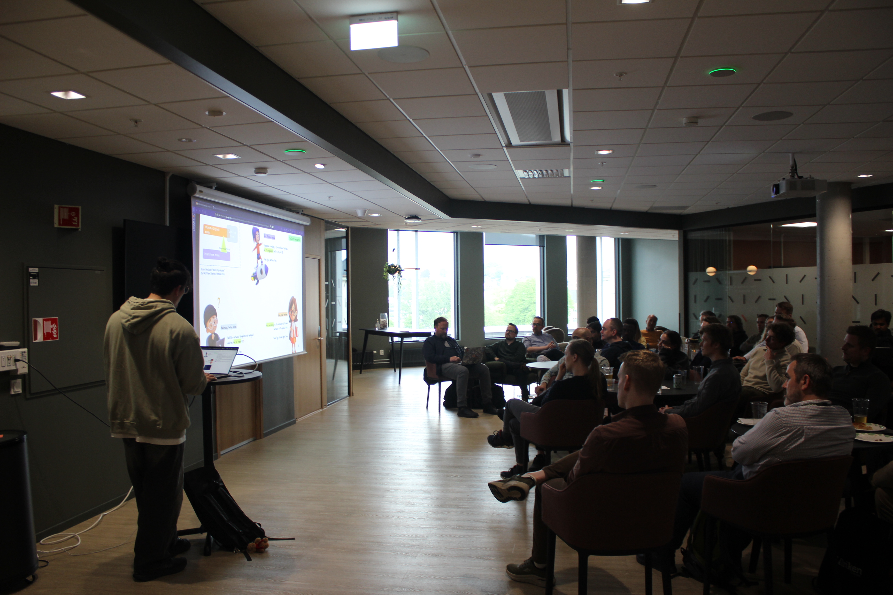
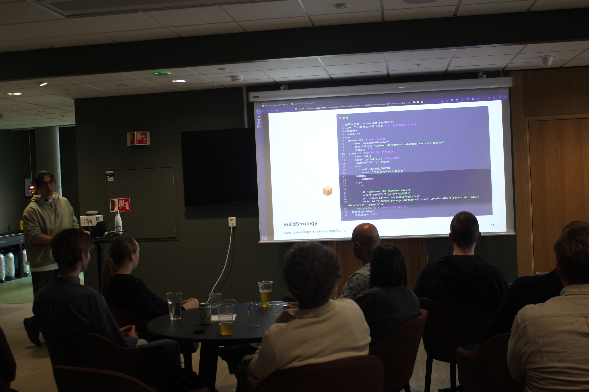
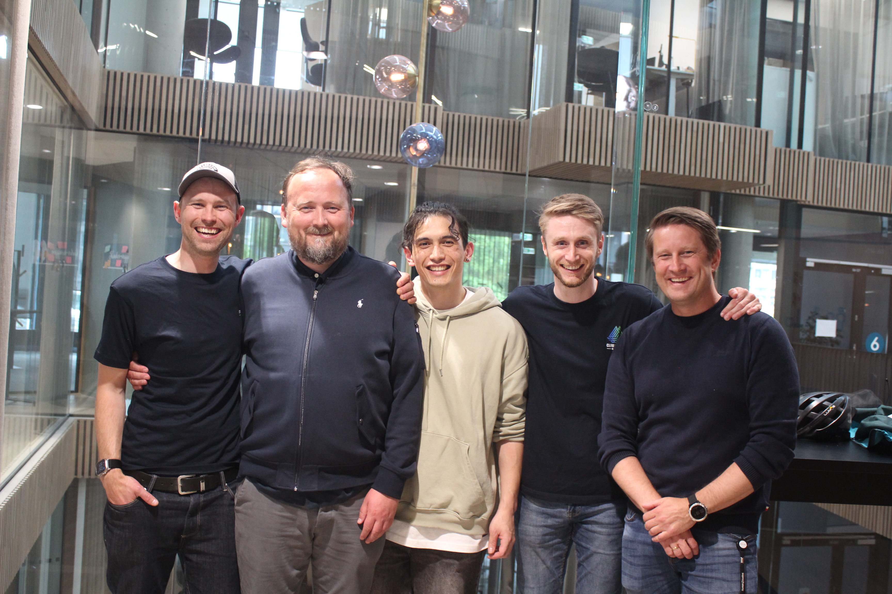

*Welcome to the type of blog post that can only be written under the influence of Norwegian cider.*

**TL;DR:** I'm Nui, gave my first public talk at [Cloud Native Bergen](https://2025.cloudnativebergen.dev/) meetup, I won a ticket for [ContainersDay](https://www.containerdays.io/containerdays-conference-2025/) happening this September 2025, all of that during my birthday.

First blog post, first time I introduce myself on the internet.

- "Nui, engineer, [born there](https://www.google.com/maps/place/Tahiti/@-25.2568525,-150.0680355,4z/data=!4m6!3m5!1s0x769bb353982d1e65:0x413cf43a8988a3fa!8m2!3d-17.6509195!4d-149.4260421!16zL20vMGhiNmc?entry=ttu&g_ep=EgoyMDI1MDUyMS4wIKXMDSoASAFQAw%3D%3D) and super enthusiast about cloud native tech and its community." ~something along those lines.

And today is a special day for me as I gave my first public talk ever during [Cloud Native Bergen Community](https://www.linkedin.com/company/cloud-native-bergen/?lipi=urn%3Ali%3Apage%3Ad_flagship3_search_srp_all%3BlkJJDenvSTizj2RkFeU9Bw%3D%3D) meetup.
For context, my first encounter with the CNCF world was 2 years ago where the "click" happened at KubeCon Paris 2024.
That conference was an eye-opener; I found a place where most people are passionate about computer science and are curious-minded, like me.

Why did I not know about it before? This question haunted me for a year, until my 2nd KubeCon in London, 2025.
There, I met [Artem Lajko](https://www.linkedin.com/in/lajko/) and [Graziano Casto](https://www.linkedin.com/in/castograziano/) during Cloud Rejekts which transformed my solo trip into a unique community-and-inclusive experience.
With them and speakers like [Liz Rice](https://www.linkedin.com/in/lizrice/), [Eric D. Schabell](https://www.linkedin.com/in/ericschabell/), and [Marcus Noble](https://www.linkedin.com/in/marcusnoble/) - to name a few - **I started to get the "I-wanna-speak-on-stage" fever**. Pretty unexpected for an introvert.

Fast-forward 2 months later, I engaged with the local community in Bergen by speaking about [Shipwright](https://shipwright.io), a CNCF Sandbox project.

*What a stressful experience, yet I was full of excitement.* Here is the content of my presentation:

<iframe src="https://docs.google.com/presentation/d/e/2PACX-1vTpBrAS8NgDdrx6JcCYKxWrMPy0I0pRpzzMFvxgoD_EPae-PPYgaRd_QNoPMVzU3PrQKVfm-HK9kjPK/pubembed?start=false&loop=true&delayms=10000" frameborder="0" width="1440" height="839" allowfullscreen="true" mozallowfullscreen="true" webkitallowfullscreen="true"></iframe>

I got the floor for more than 20 minutes, where I delivered the features and all the cool things about Shipwright in front of ~60 techies. Unexpectedly, my talk was well received and the topic interested many. Perhaps, because it was my very first talk, I convinced myself that I'd be boring.

To analyze my performance, I collected feedback from my audience to become better. Surely, there were well-rounded speakers in the room such as [Hans Kristrian Flatten](https://www.linkedin.com/in/hansflaatten/), a well-known CNCF Ambassador, that I could learn from. So I've asked everyone to criticize my performance through a form.

<iframe width="600" height="374" seamless frameborder="0" scrolling="no" src="https://docs.google.com/spreadsheets/d/e/2PACX-1vSSFsqKBjftetNE_lEI2Uv1efwI42Fuswmrds0Y8i84NIaQxF7DYbiisVnbK9hByTcLjrs2YgdHnMWn/pubchart?oid=640609057&amp;format=interactive"></iframe>

I had 2 goals while delivering my talk:

1. **Increase the awareness about Shipwright** to my audience, to grow the adoption of Shipwright and other CNCF open-source projects.
2. **Get out of my comfort zone** and talk in front of veterans about subjects I'm passionate about.

These stats are just wholesome and rewarding. But this is just the beginning; there is room for improvement. One of the feedbacks I got is:
> Nice visual profile on the slides and + for demo. Go full-tech without considering the audience, they will adapt :)

My fear was that people would get bored or lost in the technicalities of Kubernetes, so I researched my audience beforehand. It turned out that a minority of them were salespeople, managers, and non-technical individuals. Therefore, I decided to make my talk beginner-friendly to be inclusive. However, this feedback is a reminder that people who attend this kind of meetup love the *nitty-gritty*, and I shouldn't be afraid to dive into it, at least for some parts of my talk. **Thank you, anonymous attendee**; I'll remember that for my next endeavor!

This day will stay in my book; at the end of the day, it is one of those "my first time" moments. It seems to be the right time to announce that I've been appointed **organizer** for Cloud Native Bergen Community and our next big event [Cloud Native Day Bergen](https://2025.cloudnativebergen.dev/) this fall, joining this incredible team:

Coincidentally, [I'm thrilled to have won a free ticket](https://www.linkedin.com/posts/lajko_i-feel-a-bit-like-willy-wonka-today-activity-7333371470733094912-ICOz?utm_source=share&utm_medium=member_desktop&rcm=ACoAAB_Zdy0BPN1JQlGdsuIfqOjahBgs0s4xKJQ) to [ContainersDay 2025](https://www.containerdays.io/containerdays-conference-2025/), so expect me in Hamburg from the 9th-11th of September 2025 (as an attendee, this year at least)!

On a final note, I'd like to thank:

- [Eric D. Schabell](https://www.linkedin.com/in/ericschabell/), [Marcus Noble](https://www.linkedin.com/in/marcusnoble/), [Artem Lajko](https://www.linkedin.com/in/lajko/), and [Andres Morey](https://www.linkedin.com/in/andres-morey/) for all the best tips to deliver an engaging presentation.
- The maintainers and community of [Shipwright](https://github.com/shipwright-io/build) for reviewing the structure of my talk.
- [Paolo Dettori](https://www.linkedin.com/in/pdettori/), maintainer of the CNCF project [KubeStellar](https://kubestellar.io/), for trusting me as a future co-speaker (hopefully) for our upcoming talk at KubeCon North America 2025.
- The Cloud Native Bergen organizers team and my best friends who supported me during the meetup.

Sincerely - Nui, the speaker with the green hoodie.
